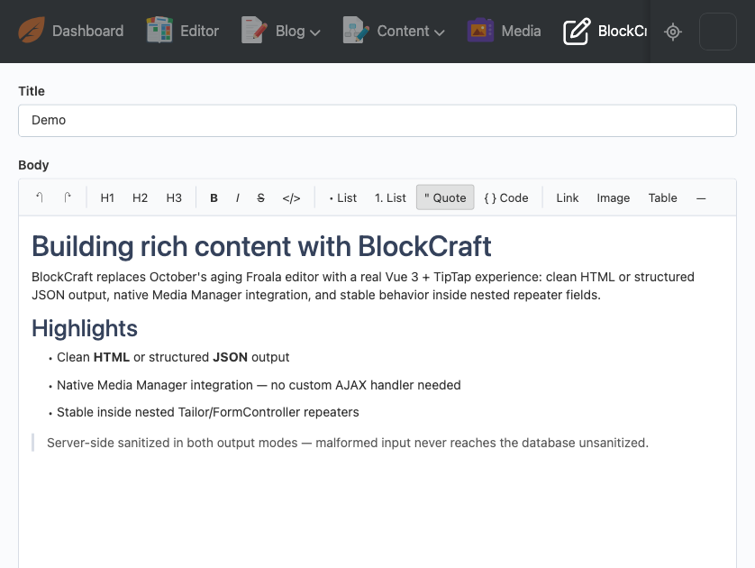

<p align="center">
  <picture>
    <source media="(prefers-color-scheme: dark)" srcset="art/banner-dark.png">
    
  </picture>
</p>

# BlockCraft

A `FormWidget` (`blockcraft`) that replaces October's native Froala
`richeditor` with a Vue 3 + [TipTap](https://tiptap.dev) block editor -
clean HTML or structured JSON output, native Media Manager integration, and
stable behavior inside nested Tailor/FormController repeaters.

[](https://packagist.org/packages/amjadiqbal/blockcraft-plugin)
[](https://github.com/amjadiqbal/oc-blockcraft-plugin/actions/workflows/tests.yml)
[](https://packagist.org/packages/amjadiqbal/blockcraft-plugin)
[](LICENSE.md)

<p align="center">
  
</p>

## Why

October's built-in rich text editor ships a pinned, several-major-versions-
old Froala build, has limited toolbar customization, and has documented
breakage when combined with Tailor repeater fields. BlockCraft is a
drop-in-shaped alternative: a real Vue 3 SFC built on TipTap's ProseMirror
foundation, with server-side sanitization independent of anything configured
in the browser.

## Requirements

- October CMS **4.2+** (needs the Vue 3 / native ESM backend)
- PHP 8.2+

## Installation

```
composer require amjadiqbal/blockcraft-plugin
```

(Composer package name ends in `-plugin` per October's own naming
convention; it still installs at `plugins/amjadiqbal/blockcraft`.)

## Usage

```yaml
# fields.yaml
body:
    label: Body
    type: blockcraft
    outputFormat: html   # or 'json' for a structured TipTap document
    height: 400px
```

### Options

| Option | Type | Default | Description |
|---|---|---|---|
| `outputFormat` | `html` \| `json` | `html` | Persisted shape of the field's value. |
| `height` | string | `400px` | CSS height of the editor's content area. |
| `buttons` | array \| null | `null` (full default toolbar) | Restrict visible toolbar buttons - see the full list in `formwidgets/BlockCraft.php`'s docblock. |
| `readOnly` | bool | `false` | Renders the content non-editable. |

`outputFormat: json` stores TipTap's own document schema
(`{type: 'doc', content: [...]}`) rather than an HTML string - useful when
your frontend wants to render content itself instead of trusting stored
markup, or when you want a stable structure for programmatic transforms.

### Media Manager

Clicking the toolbar's Image button launches October's real, built-in Media
Manager (`oc.mediaManager.popup`) when the current backend user has
`media.library` access - no extra setup needed, no custom AJAX handler on
BlockCraft's side. Selected images can be aligned left/center/right from the
toolbar once selected in the editor.

### Sanitization

Both output modes are sanitized **server-side**, independent of anything the
browser sent:

- `html` mode: `classes/HtmlSanitizer.php` strips any tag/attribute outside
  an explicit allow-list (matching BlockCraft's own extension set - nothing
  the editor can't already produce), strips `javascript:`/`data:` URIs, and
  forces `rel="noopener noreferrer"` on `target="_blank"` links.
- `json` mode: `classes/JsonSanitizer.php` validates the decoded value is a
  well-formed TipTap document and recursively drops any node/mark type or
  attribute key outside that same allow-list.

Malformed input in either mode degrades to a safe empty value - it never
throws and never reaches the database unsanitized.

## Repeater lifecycle

BlockCraft's ESM hydrator (`assets/js/blockcraft.ts`) watches for its mount
elements being removed from the DOM (a Tailor/FormController repeater row
deleted) and destroys the corresponding TipTap/Vue instance via a
`MutationObserver` - this prevents the memory leaks and detached event
listeners a naive integration would accumulate as rows are added and removed.

## Development

```
npm install
npm run dev      # Vite dev server with HMR
npm run build    # production bundle -> assets/dist/
npm run typecheck
npm test         # Vitest, mounts the real TipTap editor under jsdom
```

### Testing

The PHPUnit suite (`tests/`) needs October's own base classes
(`PluginTestCase`, `Backend\Classes\FormField`/`FormWidgetBase`) to mean
anything, so it must run from inside a real October CMS application with
this plugin installed under `plugins/amjadiqbal/blockcraft`:

```
composer create-project october/october octoberapp
rsync -a --exclude=node_modules --exclude=assets/dist --exclude=.git \
  ./ octoberapp/plugins/amjadiqbal/blockcraft/
cd octoberapp
php artisan october:migrate
vendor/bin/phpunit --configuration path/to/phpunit.blockcraft.xml
```

See `.github/workflows/tests.yml` for the exact, working invocation (this is
literally the same script CI runs).

## License

MIT - see [LICENSE.md](LICENSE.md).

## Support

- 🐛 **Bug or feature request** — [open an issue](https://github.com/amjadiqbal/oc-blockcraft-plugin/issues)
- 💬 **Questions & community** — join the Discord (invite coming soon)
- 🔒 **Security issue** — please report privately via GitHub's security tab

## Need this customised, or something built?

I'm available for custom development, package integration, and technical consulting.

[](https://www.upwork.com/freelancers/amjadkhatri)

## More packages

Part of a family of open-source packages — see [all of them](https://github.com/amjadiqbal?tab=repositories).

| | |
|---|---|
| [oc-vueforge-plugin](https://github.com/amjadiqbal/oc-vueforge-plugin) | The rapid Vue 3 component & widget engine for October CMS |
| [laravel-tiptap](https://github.com/amjadiqbal/laravel-tiptap) | Tiptap editor for Laravel, backend-driven config and secure uploads |
| [kiln](https://github.com/amjadiqbal/kiln) | Deploy-time OPcache control for Laravel |
| [laravel-logpulse](https://github.com/amjadiqbal/laravel-logpulse) | Log health monitoring & intelligent alerting for Laravel |
